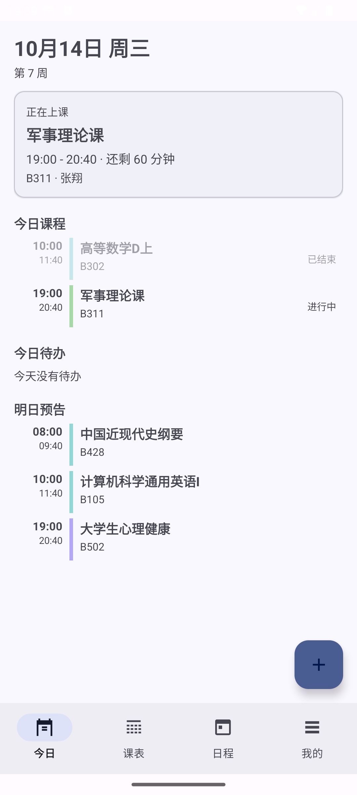
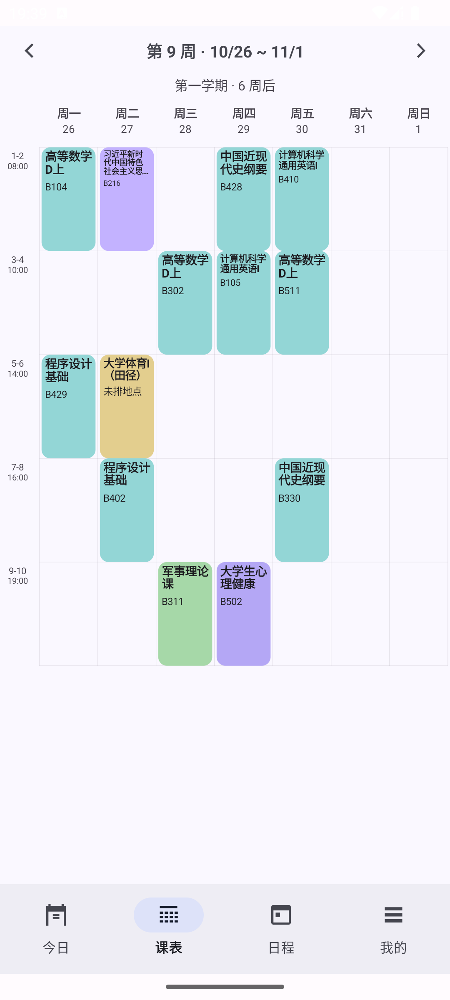
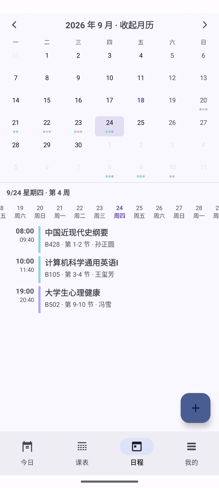
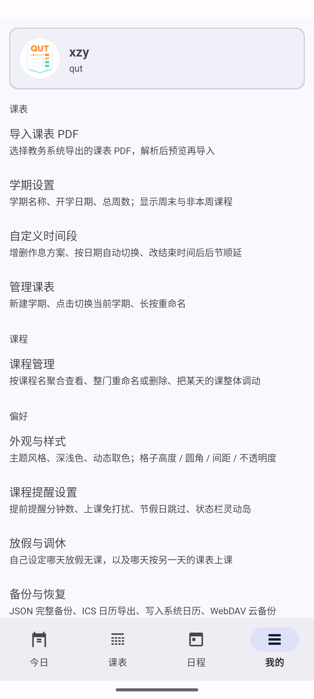

# QUT课表

> 面向青岛理工大学学生的开源课表应用
> 一个 App 解决：**课表导入、日程与待办、周次推算、课程提醒、放假调休、桌面小组件、备份同步**

[](#环境要求)

---

## 目录

- [界面速览](#界面速览)
- [功能](#功能)
- [下载安装](#下载安装)
- [从源码构建](#从源码构建)
- [课表 PDF 从哪来](#课表-pdf-从哪来)
- [权限说明](#权限说明)
- [技术栈](#技术栈)
- [项目结构](#项目结构)
- [版本号规则](#版本号规则)
- [已知限制](#已知限制)
- [贡献](#贡献)
- [License](#license)

---

## 界面速览

底部四个主页面，从左到右依次为「今日 / 课表 / 日程 / 我的」。

| 今日 | 课表 | 日程 | 我的 |
| --- | --- | --- | --- |
|  |  |  |  |

> 截图待补充：把图片放进仓库根目录的 `picture/`，文件名与上表 `src` 一致即可。

---

## 功能

### 课表

- **PDF 一键导入**：直接读取教务系统导出的课表 PDF，自动还原星期、节次、周次、教师、地点、学分、考核方式。
- **周次自动推算**：填一次开学日期，之后「今天第几周」全自动；每门课只在它自己的周次范围内出现。
- **周 / 天 / 月三种视图**：周视图网格可左右滑动切周、点标题跳周；日程页有整月日历 + 日期轴。
- **临时增删改**：长按课程块可修改、**第 N 周停课**（只摘掉这一周，其余照常）或整门删除。
- **课程管理**：按课程名聚合查看，支持整门重命名、批量删除、把某一天的课整体调到另一天。

### 日程与待办

- 待办 / 活动 / 考试 / 作业分类，可勾选完成，完成状态在今日页与日程页双向同步。
- 支持定时或不限时；不限时的待办不显示占位时间。

### 放假与调休

- **放假**：设定某天或某个日期区间放假，那几天没有课、也不会提醒。
- **调休**：设定「A 月 B 日上 C 月 D 日的课」，那一天会照搬参照日的课表。
- 应用**不内置任何节假日数据**，全部按自己学校的通知填写。

### 提醒

- 上课前按设定的分钟数提醒，可按课程单独覆盖提前量。
- **上课期间自动免打扰**（仅静音或系统勿扰），下课自动恢复。
- **状态栏 / 灵动岛**：Android 16 用 `Notification.ProgressStyle` 申请常驻进度通知，显示当前课程与剩余时间；仅在当天第一节课前到最后一节课后运行，其余时间零占用。低版本降级为普通常驻通知。

### 桌面小组件

- 今天 / 明天的课程概览与当日课程数，深浅色各有外观，点按直达应用。
- **每日零点自动更新**：重排提醒并刷新小组件，不需要打开 App。

### 备份、迁移与同步

- **JSON 导出 / 导入**：整表备份，含多学期、多作息方案与全部偏好，换机一键还原。
- **ICS 导出**：导入 iOS / Android / 桌面日历后自带课前提醒。
- **写入系统日历**：把当前课表添加到系统日历账号（重复同步会自动查重）。
- **WebDAV 云备份**：上传到自建服务器，或从云端恢复。

### 外观

- **Material You**：完整的 M3 配色角色，支持动态取色（Android 12+，跟随系统壁纸）。
- 三套主题预设（书卷 / 通透 / 柔绘），深浅色可跟随系统或手动指定。
- 课表外观可调：格子高度、圆角、间距、不透明度。
- 课表排版做了字号自适应、地点在 `@ （ (` 等分隔符处优先换行、同名课程统一配色。

### 其他

- **首次使用引导**：设置学期 → 下载 PDF（带图示）→ 导入 → 完善个人信息。
- **检查更新**：可手动检查，也可启动时自动检查（一天一次，仅在新版本存在时提示）。

---

## 下载安装

到 [Releases](https://github.com/Gingmzmzx/QUTSchedule/releases) 下载最新的 APK 直接安装。

升级时覆盖安装即可，本地数据不会丢失。

---

## 从源码构建

### 环境要求

| 项目 | 版本 |
| --- | --- |
| Android SDK | compileSdk 36，minSdk 26 |
| JDK | 17 及以上 |
| Gradle | 随 Wrapper 提供（`./gradlew`） |

### 命令

```bash
git clone https://github.com/Gingmzmzx/QUTSchedule.git
cd QUTSchedule

# 编译 Debug 包，产物在 app/build/outputs/apk/debug/app-debug.apk
./gradlew :app:assembleDebug

# 跑单元测试
./gradlew :app:testDebugUnitTest
```

`local.properties` 里的 `sdk.dir` 需要指向本机 Android SDK，用 Android Studio 打开项目时会自动生成。

---

## 课表 PDF 从哪来

在教务系统里找到课表查询页，用浏览器的「打印 → 另存为 PDF」导出即可。应用内的**首次引导第 3 步**有带截图的分步说明。

导入前**不需要**手动整理 PDF，解析器会自动处理。解析结果会先预览，确认无误再导入。

> **关于其他学校**：`pdf/TimetableParser` 目前只适配青岛理工大学教务系统的课表版式（四列固定排版 + `周数/校区/地点/教师/教学班` 明细串）。其他学校的课表版式不同，需要相应调整解析规则，欢迎提 PR。

---

## 权限说明

| 权限 | 用途 |
| --- | --- |
| `POST_NOTIFICATIONS` | 发送上课提醒 |
| `SCHEDULE_EXACT_ALARM` / `USE_EXACT_ALARM` | 让提醒准时触发 |
| `RECEIVE_BOOT_COMPLETED` | 重启后重建闹钟 |
| `FOREGROUND_SERVICE` / `FOREGROUND_SERVICE_SPECIAL_USE` | 上课期间在状态栏常驻当前课程 |
| `ACCESS_NOTIFICATION_POLICY` | 上课免打扰（可选，不授权也能用其它功能） |
| `READ_CALENDAR` / `WRITE_CALENDAR` | 写入系统日历（仅在你点该功能时申请） |
| `INTERNET` | 检查更新、WebDAV 云备份 |

**没有账号系统，没有埋点统计。** 课表、待办、个人信息全部保存在应用私有目录下的 `schedule.json`，不会上传。联网只发生在你主动触发的两个场景：检查更新与 WebDAV 备份。

---

## 技术栈

- **语言**：Java 11（无 Kotlin）
- **UI**：AndroidX AppCompat + Material Components 1.14，Material 3 主题
- **存储**：Gson 序列化成单个 JSON 文件，无数据库
- **PDF 解析**：自己实现的极简提取器（`pdf/PdfTextExtractor`），解 FlateDecode 内容流 + 解析 `Tm`/`Tj` 取带坐标文本，**不依赖任何第三方 PDF 库**
- **最低版本**：Android 8.0（API 26），因为用到 `java.time` 与通知渠道

---

## 项目结构

```
app/src/main/java/com/netessx/qutschedule/
├── MainActivity.java            四页宿主，统一处理编辑、删除与提醒同步
├── QutScheduleApp.java          Application，套用主题模式与动态取色
├── data/                        存储与查询
│   ├── ScheduleStore.java           JSON 读写、v1→v2 迁移、坏数据兜底
│   └── ScheduleRepository.java      按学期 / 作息 / 放假调休查询课程与待办
├── model/                       数据模型
│   └── AppData · Semester · TimeScheme · Course · Todo · DayRule · Prefs · Profile
├── pdf/                         课表 PDF 解析
│   ├── PdfTextExtractor.java        极简 PDF 文本提取（无第三方依赖）
│   ├── TimetableParser.java         版式还原
│   ├── WeekSpec.java                周次表达式（4-17周 / 第4周 / 5-15周(单)）
│   └── Structured.java              从备注识别学分、考核方式、实验课
├── ui/                          界面
│   ├── TodayFragment · WeekFragment · AgendaFragment · MineFragment   四个主页面
│   ├── WeekGridView · MonthGridView                                    自绘网格
│   ├── OnboardingActivity.java                                         首次使用引导
│   ├── BaseActivity · SettingsUi                                       二级页基类与控件工厂
│   └── ZoomableImageView · ImagePreviewDialog · UpdatePrompt
├── reminder/                    提醒
│   ├── ReminderScheduler · ReminderReceiver
│   └── DndController.java           上课免打扰
├── live/                        状态栏 / 灵动岛
├── widget/                      桌面小组件
├── backup/                      JSON / ICS / 系统日历 / WebDAV
├── update/                      检查更新
└── util/                        日期、节次、配色、调休、排版等工具
```

存储结构见 [`REFACTOR_PLAN.md`](REFACTOR_PLAN.md)，产品设计见 [`DESIGN.md`](DESIGN.md)。

---

## 版本号规则

- `versionName`：语义化版本，形如 `v1.1.1`，显示在「我的 → 关于」，也用作 release 标签。
- `versionCode`：`年份后两位 + 月 + 日 + 当日构建序号`，例如 `26091701` 表示 2026-09-17 的第 1 次构建。

构建序号记在仓库根目录的 `version.properties`（已加入 `.gitignore`，属本地构建产物），每次 `assembleDebug` / `assembleRelease` 后自增，跨天自动从 `01` 重来。

---

## 已知限制

- **PDF 解析只适配青岛理工大学**的课表版式，其他学校需要改 `pdf/TimetableParser`。
- **三套主题预设目前只改变课表的几何参数**（圆角 / 间距 / 不透明度 / 格子高度），尚未为每套提供独立配色。
- **调休按自然周计算**：调休那天仍属于它所在的那一周，只是当天照搬参照日的课表。
- **没有情侣课表功能**。
- 编译与单元测试可保证，但界面视觉效果需要真机确认；不同厂商 ROM 对灵动岛 / 常驻通知的呈现差异较大。

---

## 贡献

欢迎 Issue 与 PR。提 PR 前请确认：

```bash
./gradlew :app:assembleDebug :app:testDebugUnitTest
```

两个任务都通过。现有的 27 个单元测试覆盖了 PDF 解析、周次表达式、调休规则与倒计时计算，改动这些部分时请一并补充测试。

---

## License

[Apache License 2.0](LICENSE) · 不得商用
